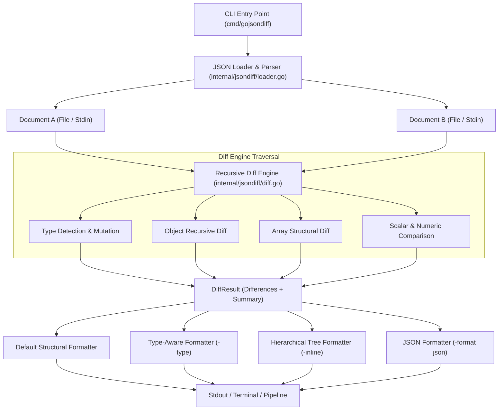
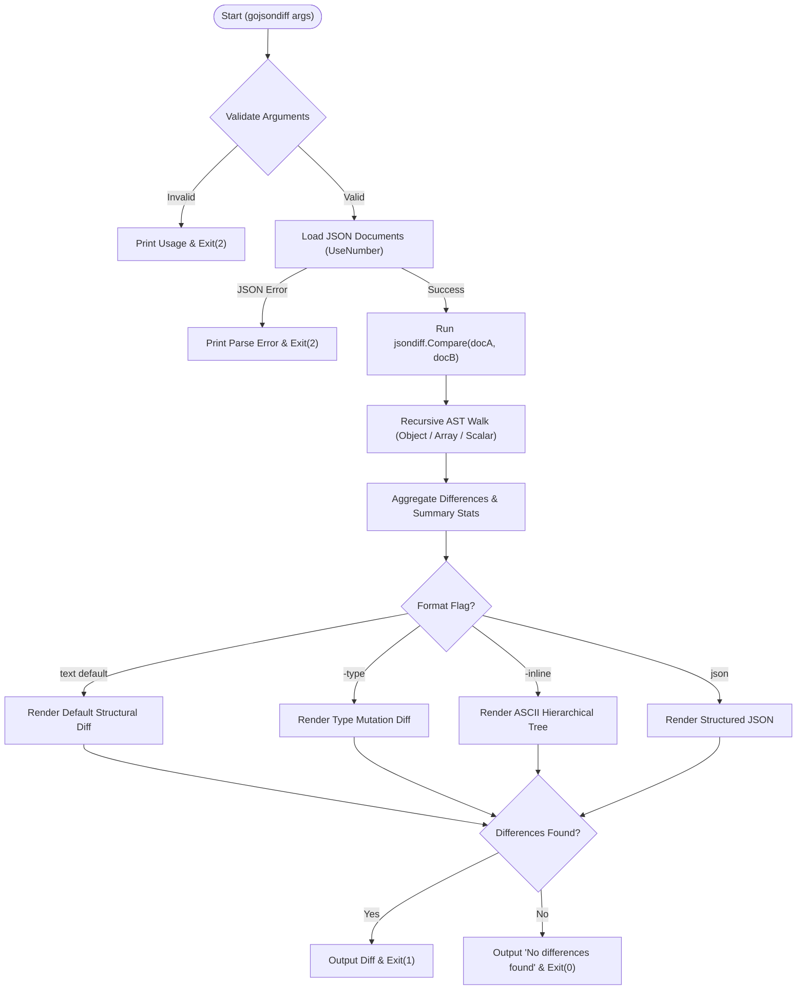

# goJsonDiff

A high-performance structural JSON diff utility and Go package built with zero third-party dependencies (pure Go standard library, targeting Go 1.26).

Unlike conventional textual or line-by-line diff utilities (such as `diff` or `git diff`), `goJsonDiff` compares JSON documents based on their underlying **data and structure**:
- Ignores key order in objects (`{"a": 1, "b": 2}` equals `{"b": 2, "a": 1}`).
- Ignores whitespace, indentation, and formatting discrepancies.
- Accurately tracks deep hierarchical changes using standard JSON paths (`user.address.city`, `users[1].name`).
- Accurately detects:
  - **Added fields** (`+`)
  - **Removed fields** (`-`)
  - **Modified values** (`~`)
  - **Type mutations** (`~ type: <oldType> → <newType>`).
- Supports human-readable structural diff, hierarchical tree/inline view (`-inline`), type mutation reporting (`-type`), ANSI color terminal highlighting, and machine-readable structured JSON diff output (`-format json`).

---

## Installation

### Prerequisites
- Go 1.26 or later installed.

### Build from Source
```bash
git clone git@github-golang:arthurgray2k/goJsonDiff.git
cd goJsonDiff
make build
```

Or install directly using the Go toolchain:
```bash
go install ./cmd/gojsondiff
```

---

## Quick Start

### Basic Structural Comparison
```bash
gojsondiff original.json modified.json
```

**Output:**
```
JSON DIFF
  age
    - 40
    + 41
  city
    - "Delhi"
  country
    + "India"

Summary: 3 total changes (1 added, 1 removed, 1 modified, 0 type changed)
```

### Type Mutations (`-type`)
```bash
gojsondiff -type original.json modified.json
```

**Output:**
```
JSON DIFF
  age
    ~ type: number → string
    - 40
    + "40"
```

### Hierarchical Tree / Inline View (`-inline`)
```bash
gojsondiff -inline original.json modified.json
```

**Output:**
```
JSON DIFF
user
├── name
│   └── = "Atur"
├── age
│   └── ~ 40 → 41
├── address
│   ├── city
│   │   └── ~ "Delhi" → "Noida"
│   └── zip
│       └── - "110001"
└── email
    └── + "atur@example.com"
```
Where:
- `+` Added
- `-` Removed
- `~` Changed
- `=` Unchanged

### Stdin Streaming
Pipe JSON directly via standard input using `-`:
```bash
curl -s https://api.example.com/v1/config | gojsondiff expected.json -
```

### Colorized Terminal Diff
```bash
gojsondiff -color always original.json modified.json
```

### Structured JSON Output
```bash
gojsondiff -format json original.json modified.json
```

---

## Project Structure

```text
goJsonDiff/
├── cmd/
│   └── gojsondiff/
│       ├── main.go              # CLI entry point, argument parsing, exit codes
│       └── main_test.go         # CLI integration and unit tests
├── internal/
│   └── jsondiff/
│       ├── diff.go              # Core recursive comparison engine
│       ├── diff_test.go         # Unit tests and benchmarks (>85% coverage)
│       ├── formatter.go         # Structural, type-aware, tree/inline, and JSON formatters
│       ├── formatter_test.go    # Formatters unit tests
│       ├── loader.go            # Stream and file JSON decoding with json.Number
│       └── loader_test.go       # Loader unit tests
├── examples/
│   ├── original.json            # Sample baseline document
│   ├── modified.json            # Sample updated document
│   ├── sample_structural_diff.txt # Sample default structural diff output
│   ├── sample_type_diff.txt     # Sample type mutation diff output (-type)
│   ├── sample_inline_tree_diff.txt # Sample hierarchical tree diff output (-inline)
│   └── sample_diff.diff         # Sample diff format file
├── go.mod                       # Go 1.26 module definition
├── Makefile                     # Build and testing targets
├── README.md                    # Project documentation
├── USAGE.md                     # Comprehensive CLI usage guide
└── LICENSE                      # Mozilla Public License 2.0
```

---

## Architecture & Workflow

### Architecture Component Flow



### Runtime Execution Workflow



---

## Programmatic Library Usage

`goJsonDiff` can be embedded into Go applications:

```go
package main

import (
	"fmt"
	"log"

	"github.com/arthurgray2k/goJsonDiff/internal/jsondiff"
)

func main() {
	docA, err := jsondiff.LoadFromBytes([]byte(`{"service": "auth", "port": 8080}`))
	if err != nil {
		log.Fatal(err)
	}

	docB, err := jsondiff.LoadFromBytes([]byte(`{"service": "auth", "port": "8080", "ssl": true}`))
	if err != nil {
		log.Fatal(err)
	}

	result := jsondiff.Compare(docA, docB)

	if result.Equal {
		fmt.Println("Documents are identical!")
		return
	}

	// Print structural diff with types
	fmt.Print(jsondiff.Format(result, jsondiff.FormatOptions{
		Colorize:    true,
		ShowSummary: true,
		ShowTypes:   true,
	}))
}
```

---

## Testing & Verification

Run tests and check test coverage:
```bash
make test-coverage
```

Current test suite achievements:
- `cmd/gojsondiff`: >90% statement coverage
- `internal/jsondiff`: >85% statement coverage
- Clean `go vet` and `go fmt` compliance.

---

## License

This project is licensed under the Mozilla Public License Version 2.0. See [LICENSE](LICENSE) for details.
